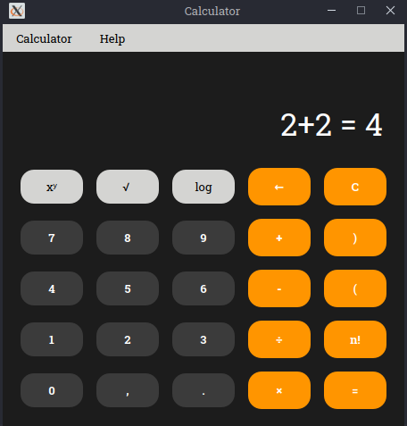

# Kalkulačka (IVS 2. projekt)
___
[]()
## Prostředí
___
`Ubuntu 22.04`

## Autoři
___
Tým xkovac58  
- xkovac58 Jakub Kováčik
- xmarek74 Roman Marek
- xpotoc07 Jakub Potoček
- xmikhe00 Vladislav Mikheda

## Instalace
___
K instalaci použijte příkaz:
```
sudo apt install calc_1.0_amd64.deb
```
## Odinstalace
___
Pro odinstalování spustíte:
```
sudo apt remove calc
```

## Spusteni pomoci Makefile 
Pro stažení závislostí a spuštění kalkulačky použijte příkaz: 
```
make
```
Pro zabalení projektu použijte příkaz:
```
make pack
```
Pro odstranění zvláštních souborů použijte příkaz:
```
make clear
```
Pro spuštění testů matematické knihovny použijte příkaz:
```
make test
```
Pro generování dokumentace použijte příkaz:
```
make doc
```
Pro spuštění kalkulačky použijte příkaz:
```
make run
```
Pro spuštění programu pro výpočet směrodatné odchylky na profiling použijte příkaz:
```
make profile
```
Pro instalaci python použijte příkaz:
```
make pyinstall
```
Pro stažení závislostí použijte příkaz: 
```
make init
```

## Licence
___
Tento program je distribuován pod [`General Public License v3.0`](LICENSE)